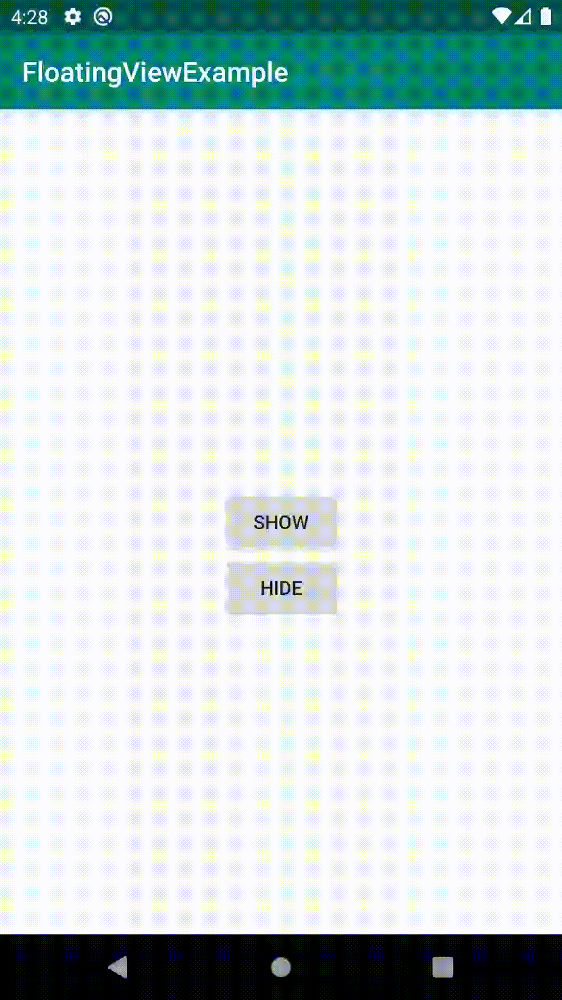

# FloatingView
A simple util to generate floating view with default style easily or custom view style easily.
> 一個可使用預設風格直接產生懸浮視窗；或是自訂內容的工具集

Maven

    <dependency>
      <groupId>github.habaco.view</groupId>
      <artifactId>view-floating</artifactId>
      <version>1.0.0</version>
      <type>pom</type>
    </dependency>


Gradle

    implementation 'github.habaco.view:view-floating:1.0.0'

### Check canDrawOverlays
 FloatingUtil provides a simple util with compat function to check canDrawOverlay
 > FloatingUtil 提供一個快速的 compat function 用以確認是否能在上層繪製
 ```kotlin
     FloatingUtil.needToGrantOverlaysPermission(context, callbackIfNeed)
 ```
 
### Navigate to Settings
FloatingUtil provides a simple util can navigate user go to settings with "Allow display over other apps"
> FloatingUtil 提供一個快速的 compat function 用以將 user 導向 "開啟上層繪製" 的設定頁面
```kotlin
  FloatingUtil.startSetting(context)
```
 
### FloatingView Builder
FloatingView design with Builder
> FloatingView 提供一個 Builder
```kotlin
  val builder = FloatingView.Builder(context)  
```
 
You can set attributes with this builder, and you can simply give few data to use default style.
> 你可以透過 Builder 設定屬性，並且僅需要些許的資料即可套用預設風格
```kotlin
  builder.title(title)
      .message(message)
      .icon(drawable)
```
 
or custom yourself
> 或是提供自定義的 View
```kotlin
  builder.contentView(customView)
```

and set some callback you want
> 再加上一些需要使用的 callback
```kotlin
  builder.onShow { }
      .onHide { }
      .onClick { }
```

finally build it and get FloatingView
> 最後建立取得 FloatingView 的實體
```kotlin
val floatingView = builder.build()
```

that's all
> 結束

  
